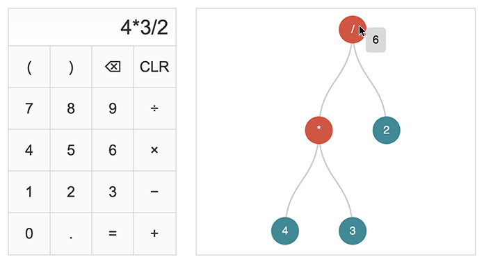

# Calculator

This repository is part of a Thing-a-Week challenge. This week’s theme is:

> Write something that uses a data structure.

A calculator that solves an arithmetic expression and displays its parse
tree.

**Demo:** [tboronczyk.github.io/taw-datastructure/src/index.html](https://tboronczyk.github.io/taw-datastructure/src/index.html)

---

